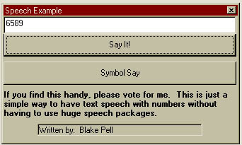



## Numeric \*Speech\* without huge speech packages

### Description

This example program includes a module file (as well as accompanied .wav files for sound) that will turn a number from a text box into speech through the speakers. Right now works from numbers 1 to 999 trillion. This is just for numbers and a few symbols and does not do words. Please vote if you like it. :)
 
### More Info
 

             |
---                |---
**Submitted On**   |2001-03-02 22:16:16
**By**             |[BP](https://github.com/Planet-Source-Code/PSCIndex/blob/master/ByAuthor/bp.md)
**Level**          |Intermediate
**User Rating**    |4.6 (32 globes from 7 users)
**Compatibility**  |VB 4\.0 \(32\-bit\), VB 5\.0, VB 6\.0
**Category**       |[Sound/MP3](https://github.com/Planet-Source-Code/PSCIndex/blob/master/ByCategory/sound-mp3__1-45.md)
**World**          |[Visual Basic](https://github.com/Planet-Source-Code/PSCIndex/blob/master/ByWorld/visual-basic.md)
**Archive File**   |[CODE\_UPLOAD15737322001\.zip](https://github.com/Planet-Source-Code/bp-numeric-speech-without-huge-speech-packages__1-21471/archive/master.zip)

